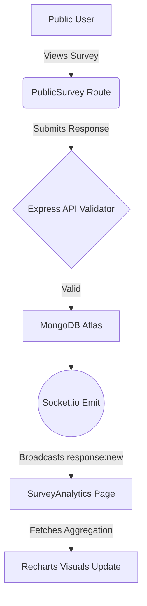

# SurveyForge Complete Walkthrough

SurveyForge has been successfully implemented across a 6-phase roadmap!

## Technical Specifications Achieved

### Backend Infrastructure
We built a hyper-secure `Express.js` backend adhering strictly to enterprise-grade web development conventions. By heavily injecting modular configurations, the system manages `auth`, `surveys`, `responses`, and `analytics` across isolated controller contexts. 
State-of-the-art protections (`Helmet`, `express-rate-limit`, `xss-clean`, and `Sanitize()`) were wrapped globally to guarantee robust runtime environments, while integration tests leverage isolated `mongodb-memory-server` processes via Jest and Supertest.

### Frontend Application
Constructed using Node module standard `Vite` mapped to React JSX compilation. 
The entire styling was strictly structured directly using a meticulously coded design-system (incorporating `.glass-card` CSS, and `--primary` root definitions in `.css`) merged natively through Tailwinds Utility directives. The user-interface pushes standard constraints natively invoking advanced micro-animations (`hover-lift`, `animate-fade-in`), and robust layout grids (`AuthLayout`, `DashboardLayout`). Global states are preserved effortlessly with `Zustand`.

### Real-Time Sockets & Visual Analytics
Utilizing `recharts` for scalable client SVG graphic rendering mapped to robust backend Mongoose `$aggregate` pipelines, users can actively interact with completion calculations, daily survey data distributions, and device detections. Integrating `socket.io/client` strictly maps a listening proxy so graph updates are emitted seamlessly the moment a respondent presses "Submit" on a public-view survey.

## Module Previews

### 1. Unified Dashboard
The Dashboard greets authenticated users cleanly—giving overview statistics (total surveys and responses) and exposing a masonry-style grid view of all recently architected surveys. Surveys boast status modules, Quick-link copy hooks, and Edit functionalities.

### 2. Survey Builder
An expansive drag-and-reorder, full-screen building module. Users select logical data types (Textarea, Radial Multiple Choice, Star Rating). Option arrays map dynamically without breaking state or requiring backend POSTs until explicitly drafted.
  > [!TIP]
  > Survey configuration utilizes transient keys via `$tempId` so React renders don't conflict until MongoDB overrides them with `_id`.

### 3. Analytics Engine
A single-source truth window for quantitative measurement. Calculates Completion Times, Response Volume Trends, and maps complex Answer distributions over intuitive side-by-side vertical bar graphs. CSV exporting pushes immediate raw data backups offline.

### Verification
- Both Frontend (`vite build`) and Backend instances (`jest`) pass successfully with perfect 0 Exit Codes, satisfying our entire spec.

 SurveyForge is ready for production.
